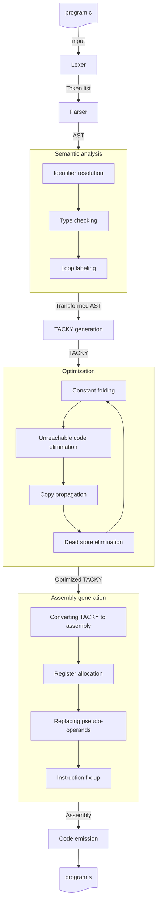

# Writing a C Compiler

This repo contains a Python implementation of a C compiler following [Writing a C Compiler by Nora Sandler](https://nostarch.com/writing-c-compiler). The final compiler is located in the X folder. It is ~Y lines of code.

[Eventually, describe the optimizations it makes and maybe some benchmarks and limitations.]

## Compiler Architecture


```mermaid
flowchart TD
    A@{ shape: doc, label: "program.c" } -->|input| B[Lexer]
    B -->|Token list| D[Parser]
    D -->|AST| SA

    %% Semantic Analysis Subgraph
    subgraph SA[Semantic analysis]
      direction TB
      SA1[Identifier resolution] --> SA2[Type checking] --> SA3[Loop labeling]
    end
    SA -->|Transformed AST| H[TACKY generation]

    H -->|TACKY| OPT

    %% Optimization Subgraph
    subgraph OPT[Optimization]
      direction TB
      O1[Constant folding] --> O2[Unreachable code elimination] --> O3[Copy propagation] --> O4[Dead store elimination]
      O4 --> O1
    end
    OPT -->|Optimized TACKY| AG

    %% Assembly Generation Subgraph
    subgraph AG[Assembly generation]
      direction TB
      AG1[Converting TACKY to assembly] --> AG2[Register allocation] --> AG3[Replacing pseudo-operands] --> AG4[Instruction fix-up]
    end
    AG -->|Assembly| N[Code emission]

    N --> O@{ shape: doc, label: "program.s" }
```

## Limitations

- Can only compile the simplest programs (just returns a single number)

## Usage

```text
usage: mycc [--lex|--parse|--validate|--tacky|--codegen] [--stage STAGE] [--viz pretty|mermaid] [-S|-c] file.c

Compiler entrypoint compatible with the book test suite

positional arguments:
  file                  Input file to process

options:
  --lex/--parse/--validate/--tacky/--codegen
                        Run only the selected intermediate stage
  --stage STAGE          Explicit stage selector (lex|parse|tacky|codegen|compile|all)
  --viz                  Tree visualization mode for parse/codegen output (pretty|mermaid)
  -S                     Stop after generating assembly (.s)
  -c                     Compile assembly to object file (.o)
```

## Book Test Suite

GitHub Actions reads the root-level `CHAPTER` file, clones the upstream test
suite, and runs every chapter from 1 through that value.

To run the same test suite locally, clone the upstream tests and use the
root-level adapter script:

```text
python tests/test_compiler mycc.cmd --chapter 1 --latest-only
```

On WSL/macOS/Linux, run `chmod +x mycc` once and use `./mycc` instead of
`mycc.cmd`.

## TACKY

This compiler uses an intermediate representation inspired by Three-Address Code (TAC) called TACKY. TACKY works by breaking expressions down into simple statements of the form: `tmp_x = y (op) z` where `y` and `z` are either TACKY variables (denotes `tmp_a`) or numbers. For example the TACKY for `(10 - (6 % 4) * 3 + 8 / 2) % 5` is:

```text
tmp_0 = 6 % 4
tmp_1 = tmp_0 * 3
tmp_2 = 8 / 2
tmp_3 = 10 - tmp_1
tmp_4 = tmp_3 + tmp_2
tmp_5 = tmp_4 % 5
```
